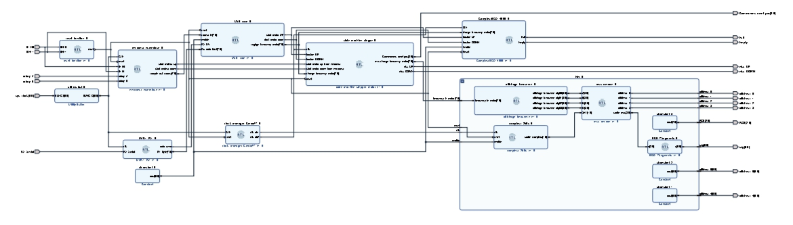

# FPGA-Based Stepper Motor Control System
This project implements a complete embedded motion control system based on an FPGA (Xilinx Artix-7) to control a stepper motor.

**Custom PCB + VHDL + UART + Python**

---

## 📌 Project Overview

This project implements a **complete embedded motion control system** based on an **FPGA (Xilinx Artix-7)** to control a **stepper motor (PAP motor)** with:

* Local speed control via **incremental rotary encoder**
* Remote control via **UART communication**
* Custom-designed **PCBs**
* Real-time display using **multiplexed 7-segment displays**

The system combines **digital design, hardware design, and embedded communication**, making it a full-stack FPGA engineering project.

<p align="center">
  
</p>

---

## 🧠 System Architecture

The system is composed of:

| Module                              | Role                                          |
| ----------------------------------- | --------------------------------------------- |
| **FPGA Board (Nexys A7 / Cmod A7)** | Central digital controller                    |
| **Encoder PCB**                     | Provides quadrature signals for speed control |
| **Stepper Driver PCB**              | ULN2003 Darlington array drives motor coils   |
| **Display PCB**                     | Multiplexed 7-segment speed visualization     |
| **PC (Python)**                     | Sends remote speed commands via UART          |

**Control Modes:**

1. **Local Mode** – Speed set with rotary encoder
2. **Remote Mode** – Speed & direction controlled from PC

---

## ⚙️ Hardware Design

### 🟩 Custom PCBs Designed in Altium Designer

Three dedicated PCBs were designed:

### 1️⃣ Encoder Board

* Incremental quadrature encoder (A/B channels)
* Pull-ups + signal conditioning
* Pmod interface to FPGA

### 2️⃣ Stepper Motor Driver Board

* ULN2003A Darlington transistor array
* Current amplification for motor coils
* Flyback protection diodes

### 3️⃣ 7-Segment Display Board

* 6 multiplexed 7-segment displays
* Transistor switching for digit selection
* Used to display:

  * Motor frequency
  * Speed counter
  * Direction

---

## 🔌 Motor Control Strategy

The motor is controlled using **wave drive (single-coil excitation)**.

### Step Sequence

| Step | Coil A | Coil B | Coil A' | Coil B' |
| ---- | ------ | ------ | ------- | ------- |
| 1    | 1      | 0      | 0       | 0       |
| 2    | 0      | 1      | 0       | 0       |
| 3    | 0      | 0      | 1       | 0       |
| 4    | 0      | 0      | 0       | 1       |

Direction is reversed by reversing the state sequence.

---

## 💻 FPGA Design (VHDL)

### 🔹 Main Modules

| File                       | Description                             |
| -------------------------- | --------------------------------------- |
| `quadrature_decoder.vhd`   | Decodes encoder A/B signals             |
| `stepper_fsm.vhd`          | FSM generating coil excitation sequence |
| `frequency_divider.vhd`    | Controls motor step rate                |
| `seven_segment_driver.vhd` | Display multiplexing logic              |
| `top.vhd`                  | System integration                      |

---

### 🔄 Quadrature Decoder

Implements a **state machine** to detect:

* Rotation direction
* Pulse count
* Speed variation

Used to dynamically adjust motor frequency.

---

### 🧩 Stepper FSM

Finite State Machine that:

* Cycles through coil activation states
* Supports forward and reverse rotation
* Operates at frequency set by control logic

---

## 🔗 UART Communication

The FPGA includes a UART interface allowing PC control.

### Python Controller

The script:

```bash
python python_uart_control.py
```

Allows sending:

* Target frequency
* Rotation direction
* Speed ramps

---

## 📟 Display System

Multiplexed 7-segment display:

* Reduces pin usage
* Displays speed in Hz
* Shows encoder counter

---

## 🛠 Development Tools

| Tool                | Purpose                         |
| ------------------- | ------------------------------- |
| **Vivado**          | FPGA synthesis & implementation |
| **VHDL**            | Digital design                  |
| **Altium Designer** | PCB design                      |
| **Python**          | UART remote control             |
| **PuTTY**           | Serial communication testing    |

---

## 🚀 Features

✔ Full custom hardware
✔ FPGA real-time control
✔ Encoder-based feedback
✔ UART remote control
✔ Motor direction & speed control
✔ Multiplexed display system

---

## 📈 Engineering Skills Demonstrated

* Digital design (FSM, timing, clock division)
* FPGA architecture (Artix-7)
* PCB design (multi-board system)
* Signal integrity (ground planes, routing)
* Embedded communication (UART)
* Hardware debugging & soldering

---

## 🔮 Possible Improvements

* Microstepping driver
* Closed-loop control
* Acceleration profiles in FPGA
* SPI/I2C control interface

---

## 👤 Author

**Jordan Franklin Nzokou**
FPGA & Embedded Systems Engineer

---

## 📜 License

This project is for academic and educational purposes.
